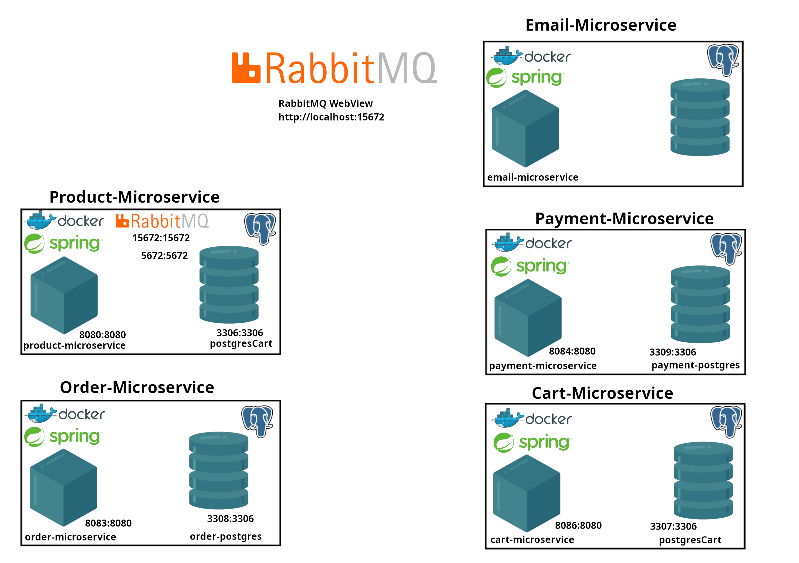

im Root verzeichnis 

```sh
docker compose up -d --build 

docker compose down -v
```

den shop-tester im shop-tester verzeichnis

```sh
next build --webpack

next start
```

sonst die postman-collection aus dem postman verzeichnis importieren und drauf los testen!

### How to start
* docker-compose build 
* start database
* start rabbitmq
* start app

```sh
docker network create internal
```

```sh
docker compose up --build
```

### RabbitMQ
The Product-Microservice starts the RabbitMQ Management

First start the Product-Microservice then the others.

* rabbitmq web view: http://localhost:15672

in den application.yml
für jpa:

```yml
  jpa:
    hibernate:
      ddl-auto: update
    database-platform: org.hibernate.dialect.PostgreSQLDialect
```

| Modus             | Beschreibung                                                                                      | Wann verwenden                                                                                 |
|--------------------|--------------------------------------------------------------------------------------------------|------------------------------------------------------------------------------------------------|
| **create**         | Droppt alle Tabellen bei jedem Start und legt sie neu an. Alle Daten gehen verloren.             | Nur beim **ersten Setup** oder wenn du **bewusst alles löschen** willst.                       |
| **update**         | Prüft bestehendes Schema und fügt fehlende Spalten automatisch hinzu.                            | Im **Entwicklungsbetrieb** nach Schemaänderungen (z. B. neue Felder wie `imageLink`).           |
| **none** oder **validate** | Prüft nur Schema oder macht nichts.                                                            | Für **Produktivumgebung** (keine automatischen Änderungen am Schema).                          |

picturesources:
spring-cloud
https://spring.io/cloud

https://www.e4developer.com/2018/01/22/spring-cloud-blueprint-for-successful-microservices/

<a href="https://www.flaticon.com/free-icons/phone" title="phone icons">Phone icons created by Freepik - Flaticon</a>

<a href="https://www.flaticon.com/free-icons/computer" title="computer icons">Computer icons created by Freepik - Flaticon</a>

<a href="https://www.flaticon.com/free-icons/iot" title="iot icons">Iot icons created by Freepik - Flaticon</a>

<a href="https://www.clipartmax.com/middle/m2i8b1Z5m2N4b1d3_cloud-gateway-spring-cloud-contract-logo/" target="_blank">Cloud Gateway - Spring Cloud Contract Logo @clipartmax.com</a>PoNYnvBjjl72DFo3vtf7/WwYgnRzaiR0Xv7cAdrKwiyqpkFcQz30i7rjmbEii0Kayj83PzbXm4gI1mrYQBacMazHha09SGJT2BUU/3AxLFiATvsVlsbzu7YgoGzgNZaTRcmigaaBkY19+nwE4UfzYKs628UO2txGXFKcnMNmLS2jOTSVJXZshWtj1CDfeN648a3KqD7ZtvGBYngVr38yK35jmMha07/M6eVbun9e0NGKmuvJ17vkZcba4IfOrXZt7E3p7VyBAwtjV50S2AwSwtYGuJHHCs6wfenTi36EVHPnmkMgasoFCkFwNjGho6Ub/RCL6fgoAg9BG+Lto9fCvxZxwRJwHdnXVkO1bGadfSToNOAGfGW1tKLMFnqpuknF4/AcS35U8YRpesXyc8EmEG0W64s6AWrjcEqdAGVgVwVUQCwyCbzNouJhZIlH8PJ4bS/OUSEh1EU3X1HhRnj3+9s3dPB/0tLl4rhaHWdLk/3x95dX15x/eMhmPSGDXD7H6I+843/kuBPAAAAAElFTkSuQmCC

<a href="https://www.flaticon.com/free-icons/module" title="module icons">Module icons created by juicy_fish - Flaticon</a>

<a href="https://www.flaticon.com/free-icons/database" title="database icons">Database icons created by juicy_fish - Flaticon</a>
